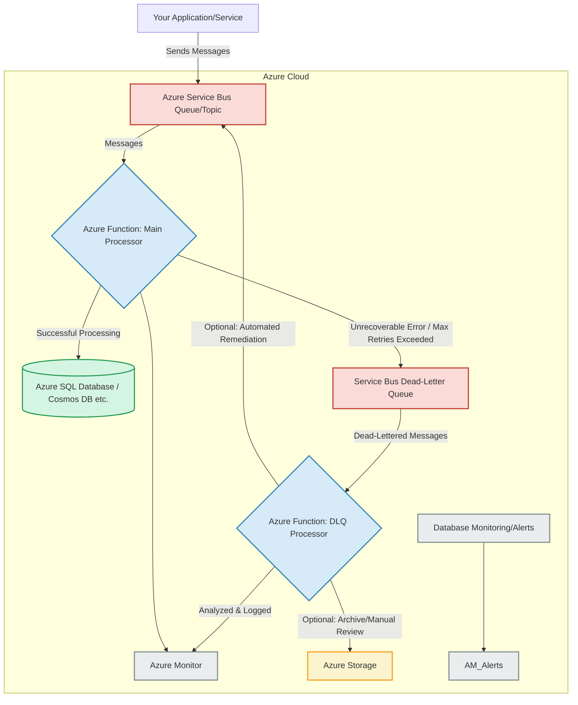
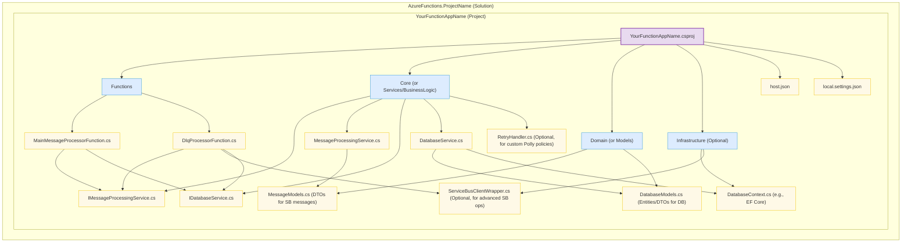

# Solution

Okay, here's a breakdown of the overall architecture and a suggested codebase project structure for your Azure Functions solution, with a strong focus on handling Dead-Letter Queues (DLQ) and ensuring resilience.

## Overall Architecture Graph



**Explanation of the Architecture:**

1.  **Message Ingestion:**

      * **User Application/Service:** Your existing application or service sends messages to an Azure Service Bus Queue or Topic.
      * **Azure Service Bus Queue/Topic:** This is the primary entry point for messages that need to be processed.

2.  **Main Message Processing:**

      * **Azure Function: Main Processor (Service Bus Trigger):**
          * This function is triggered whenever a new message arrives in the main Service Bus queue/topic.
          * **Data Extraction & Transformation:** It deserializes the message, validates its content, and extracts the necessary data.
          * **Database Update:** It attempts to update the target database with the extracted data.
          * **Transient Error Handling:** Implements retry policies (e.g., using `host.json` configuration or Polly library) for transient issues like temporary database unavailability or network glitches. The Azure Functions runtime for Service Bus triggers has built-in retry mechanisms based on the `maxDeliveryCount` setting on the queue/subscription itself before dead-lettering.
          * **Unrecoverable Errors:** If processing fails due to an unrecoverable error (e.g., malformed message, business rule violation that cannot be retried), or if configured retries are exhausted, the function will either allow the message lock to expire or explicitly abandon it. After the `MaxDeliveryCount` (configured on the Service Bus queue/subscription) is reached, Service Bus automatically moves the message to the associated Dead-Letter Queue (DLQ).

3.  **Database:**

      * **Azure SQL Database / Cosmos DB etc.:** The target database where your Azure Function writes the processed data. Design your database update operations to be **idempotent** if possible. This means if the same message is processed multiple times (due to retries), it doesn't result in duplicate data or incorrect states.

4.  **Dead-Letter Queue (DLQ) Handling:**

      * **Service Bus Dead-Letter Queue (DLQ):** This special sub-queue automatically receives messages that couldn't be processed successfully by the `Main Processor` function after the maximum number of delivery attempts.
      * **Azure Function: DLQ Processor (Service Bus Trigger):**
          * This function is triggered by messages arriving in the DLQ.
          * **Error Analysis:** It inspects the message properties, especially `DeadLetterReason` and `DeadLetterErrorDescription` (and any custom properties you might have added before dead-lettering), to understand why the message failed.
          * **Logging:** Logs detailed information about the failed message and the error to Azure Monitor (Application Insights) for diagnostics and auditing.
          * **Automated Remediation (Optional & Conditional):** For certain known, correctable errors, this function *could* attempt to fix the message or the condition and resubmit it to the main queue. This needs to be implemented carefully to avoid infinite loops.
          * **Archive/Manual Review:** For messages that cannot be automatically remediated, this function can move them to a separate Azure Storage account (e.g., Blob Storage or Table Storage) for manual inspection, reporting, or long-term archiving.
          * **Alerting:** Based on the volume or type of errors in the DLQ, alerts can be configured in Azure Monitor.

5.  **Monitoring and Alerting:**

      * **Azure Monitor (Application Insights):**
          * Collects logs, traces, and metrics from both the `Main Processor` and `DLQ Processor` functions.
          * Provides tools for querying logs, visualizing performance, and diagnosing issues.
          * Crucial for understanding function behavior, identifying bottlenecks, and troubleshooting errors, especially during downtime or edge cases.
          * **Alerts:** Configure alerts based on error rates, DLQ message count, function execution failures, or specific logged events to proactively manage issues.

**Handling Edge Cases and Downtime:**

  * **Idempotency:** The `Main Processor`'s database update logic should be idempotent. If a message is retried and processed multiple times, the outcome in the database should be the same as if it were processed once.
  * **Database Downtime:**
      * Short-lived: The `Main Processor`'s internal retries (or Service Bus delivery attempts) handle this.
      * Extended: Messages will eventually go to the DLQ. The `DLQ Processor` can then hold these messages (or move them to a "retry-later" queue if needed) until the database is back online, after which they can be reprocessed (manually or automatically).
  * **Function Downtime:**
      * If the `Main Processor` function is down, messages will accumulate in the Service Bus queue (up to its Time-To-Live, TTL). Once the function is back up, it will resume processing.
      * If the `DLQ Processor` is down, messages will accumulate in the DLQ.
  * **Poison Messages (Malformed/Unprocessable):** These will naturally flow to the DLQ after failed attempts by the `Main Processor`. The `DLQ Processor` is key to identifying, logging, and isolating these.
  * **Message Ordering:** Standard Service Bus queues do not guarantee FIFO order unless sessions are used. If order is critical, you'll need to use Service Bus sessions, which adds complexity to function implementation. For most "update database" scenarios, idempotency is more critical than strict ordering.
  * **Scalability:** Azure Functions (especially on Consumption or Premium plans) scale automatically based on load. Ensure your database is also provisioned to handle the potential concurrent load from scaled-out function instances.

## Code Base Project Structure Graph (e.g., C\# .NET)

This structure promotes separation of concerns, testability, and maintainability.



**Explanation of the Project Structure:**

  * **YourFunctionAppName.csproj:** The main Azure Functions project file.
      * **Functions/**
          * `MainMessageProcessorFunction.cs`:
              * Contains the Azure Function triggered by the main Service Bus queue.
              * Responsible for receiving the message, calling services for processing and database updates.
              * Handles exceptions and relies on Service Bus `MaxDeliveryCount` for dead-lettering.
          * `DlqProcessorFunction.cs`:
              * Contains the Azure Function triggered by the Service Bus DLQ.
              * Inspects message properties (`DeadLetterReason`, etc.).
              * Logs detailed error information.
              * Implements logic for archiving, alerting, or attempting automated/manual resubmission strategies.
      * **Core/ (or Services/BusinessLogic)**: Contains the business logic, decoupled from Azure Functions specifics.
          * `IMessageProcessingService.cs` / `MessageProcessingService.cs`:
              * Interface and implementation for business logic related to message transformation, validation, etc.
          * `IDatabaseService.cs` / `DatabaseService.cs`:
              * Interface and implementation for database interactions (CRUD operations).
              * Encapsulates logic for idempotent writes.
          * `RetryHandler.cs` (Optional): If you need more sophisticated retry logic than the built-in Azure Functions retry policies (e.g., using Polly with jitter, circuit breakers for calls to *other* services within your function). For the Service Bus trigger itself, use the `host.json` or message delivery count.
      * **Domain/ (or Models)**: Contains Plain Old CLR Objects (POCOs) or data transfer objects (DTOs).
          * `MessageModels.cs`: Defines the C\# classes representing the structure of incoming Service Bus messages.
          * `DatabaseModels.cs`: Defines entity classes for database interaction (e.g., if using an ORM like Entity Framework Core) or DTOs for database records.
      * **Infrastructure/ (Optional but Recommended for larger projects)**: Contains code related to external concerns.
          * `DatabaseContext.cs`: If using Entity Framework Core, this would be your DbContext.
          * `ServiceBusClientWrapper.cs`: (Optional) If you need to perform more advanced Service Bus operations from your DLQ processor (e.g., sending a message back to the main queue after modification), you might wrap the `Azure.Messaging.ServiceBus.ServiceBusClient` here.
      * `host.json`:
          * Configuration for the Azure Functions host.
          * **Crucially, for Service Bus triggers, retry policies related to function execution (after a message is picked up but before completion) can be defined here if using the newer retry policy feature. However, the primary mechanism for DLQ is the `maxDeliveryCount` on the Service Bus entity itself.**
          * Example for built-in retry (applied if the function execution itself throws an exception before completing/abandoning the message):
            ```json
            {
              "version": "2.0",
              "extensions": {
                "serviceBus": {
                  "messageHandlerOptions": {
                    "maxConcurrentCalls": 16, // Example
                    "autoComplete": false // Recommended to manually complete/abandon
                  }
                }
              },
              "retry": { // This is a general Function retry policy, not specific to SB trigger retries before DLQ
                "strategy": "exponentialBackoff", // or "fixedDelay"
                "maxRetryCount": 3,
                "minimumInterval": "00:00:05",
                "maximumInterval": "00:05:00"
              },
              "logging": {
                "applicationInsights": {
                  "samplingSettings": {
                    "isEnabled": true,
                    "excludedTypes": "Request"
                  }
                }
              }
            }
            ```
          * **Note:** The `maxDeliveryCount` on the Service Bus queue/subscription itself is the primary controller for when a message is sent to the DLQ. The function's retry policy in `host.json` applies to the execution attempts of the function *for a single delivery attempt* from Service Bus. If all these retries fail for one delivery, the Service Bus delivery count increments.
      * `local.settings.json`:
          * Stores local development settings like Service Bus connection strings, database connection strings, and other application settings. **Do not commit this file if it contains secrets.** Use environment variables or managed identities in Azure.

This architecture and project structure provide a robust foundation for your Azure Functions solution, emphasizing resilience and effective DLQ management. Remember to thoroughly test your error handling and DLQ processing logic.